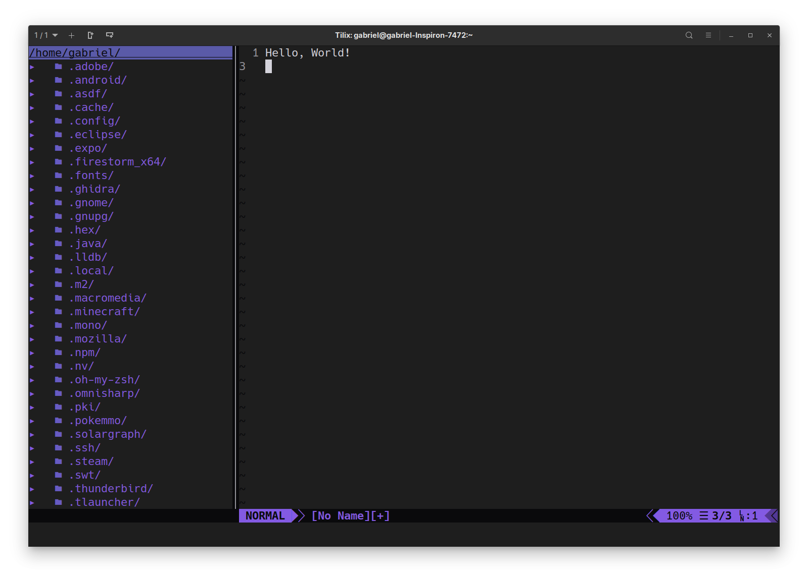

# Dotfiles

## Installation
### Requirements:
- NodeJS
- ZSH
- Oh-My-Zsh

### Step by step:
  1) inside the dotfiles folder, run the shell script on the terminal with the command: 
  ~~~shell
  ./install.sh
  ~~~
  2) Wait for the installation and be happy!
  